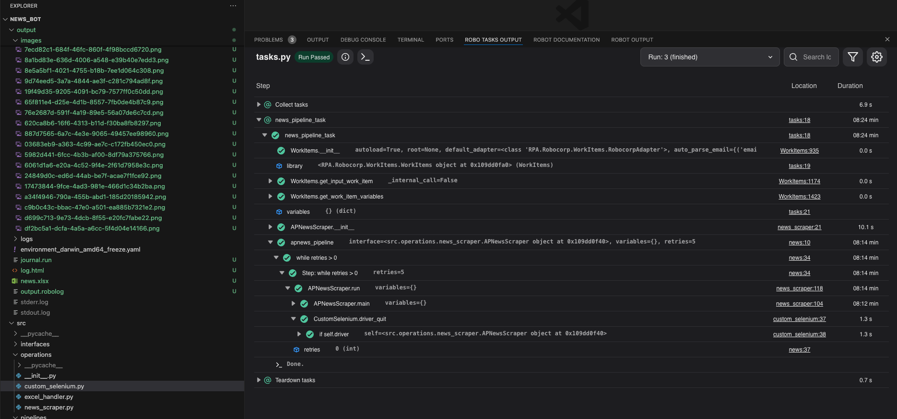

# NEWS bot

A bot to get news based on an search phrase.

# About 

This bot get the NEWS in [`https://apnews.com/`](https://apnews.com/). It's possible make some filters, get the image associated and save usefull information on Excel file.

This project is integrated with [`Robocorp`](https://robocorp.com/) (A powerfull tool used in RPA projects) plus `Python`.

<p align="center">

</p>

# Stacks

- [Python](https://python.org/)
- [Pytest](https://docs.pytest.org/en/stable/)
- [RPAFramework](https://rpaframework.org/)
- [ROBOCORP](https://robocorp.com/)

# How to use?
### Clone this repo
```
git clone https://github.com/MiqSA/news_bot
```

### Enter on the folder
```
cd news_bot
```

### Create an environment
```
python3 -m venv venv
```

### Active
```
source venv/bin/activate
```

### Install dependencies
```
pip install -r requirements.txt 
```

### Run the application
```
python tasks.py
```

# How to test?
```
pytest
```

# Improvements
- Add others news web sites.
- Increase the unit tests.
- Add docstring to all functions and types.
- Add syntaxe tests using flake8, lint e isort.
- Use SonarQube to software quality.
